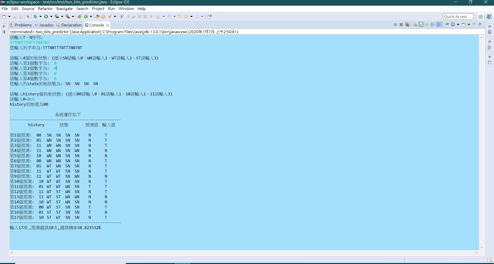

# two_bits_predictor
## 1.本程式為實作2 bits history分支預測器
* 使用語言 Java(JRE JavaSE-12)
* 開發及編譯工具 Eclipse
* 輸入方式 
    1.使用者自行輸入序列 T、N
    2.允許使用者自行決定4個初始狀態: (SN輸入0、WN輸入1、WT輸入2、ST輸入3)
    3.允許使用者自行決定History初始狀態: (00輸入0、01輸入1、10輸入2、11輸入3)
    4.以上如任一輸入錯誤，系統跳出"輸入錯誤訊息"，提醒使用者重新執行
 ## 2.執行結果參考如下

 ## 3.程式說明
 * 程式5~75行:為主程式，負責設定使用者提供之初始變數，如輸T、N入序列、SN初始狀態及History等，完成後將上述變數，傳入Method運算，並列印。        
   
   public class two_bits_predictor {
	public static void main(String[] args) {// TODO Auto-generated method stub

		Scanner sc = new Scanner(System.in);

		int input[] = inputSeri(sc); // input陣列為使用者輸入Taken或Not taken
		if (input[0] != 2) {
			int pre_list[] = new int[input.length]; // pre_list陣列為系統預測Taken或Not taken
			int state[] = stateSeri(sc); // state陣列為使用者輸入4個狀態初始設定
			if (state[0] != 4) {
				System.out.print("您輸入的state初始狀態為: ");
				for (int k = 0; k < state.length; k++) // 列印state
					Sta2string(state[k]);
				System.out.println("\n");
				int history[] = hisSeri(sc);
				if (history[0] != 2) {
					System.out.println();
					System.out.println("                                   系統運作如下");
					System.out.println("------------------------------------------------");
					System.out.println("        history" + "\t" + "          狀態             預測值   輸入值" + "\n");
					for (int x = 0; x < input.length; x++) { // 由輸入Taken or Not taken序列，取得連串2-bit history
						System.out.print("第" + (x + 1) + "個預測:" + "  ");

						if (x == 0) {
							for (int j = 0; j < history.length; j++)
								System.out.print(history[j]);
							System.out.print("\t");
							for (int k = 0; k < state.length; k++)
								Sta2string(state[k]);
							System.out.print("  ");
							pre_list[x] = predict_2(history, state);
							System.out.print("    ");
							input2string(input[x]);
							System.out.print("\n");
							continue;
						} else {
							state[modify_at(history)] = state[modify_at(history)]
									+ modify_sta(pre_list[x - 1], input[x - 1]);

							for (int k = 0; k < state.length; k++) { // 檢查state狀態，不超過邊界值
								if (state[k] > 3)
									state[k] = 3;
								else if (state[k] < 0)
									state[k] = 0;
							}
							history = his_next(history, input[x - 1]); // 更新history
							for (int j = 0; j < history.length; j++) // 列印history
								System.out.print(history[j]);
							System.out.print("\t");
							for (int k = 0; k < state.length; k++) // 列印state
								Sta2string(state[k]);
							System.out.print("  ");
							pre_list[x] = predict_2(history, state); // 將每次的預測值寫入陣列
							System.out.print("    ");
							input2string(input[x]); // 列印input
							System.out.print("\n");
						}

					}

					System.out.println("------------------------------------------------");
					misprediction(pre_list, input);
				} else
					System.out.println("請重新執行程式!!");

			} else
				System.out.println("請重新執行程式!!");
		} else
			System.out.println("請重新執行程式!!");

	}
